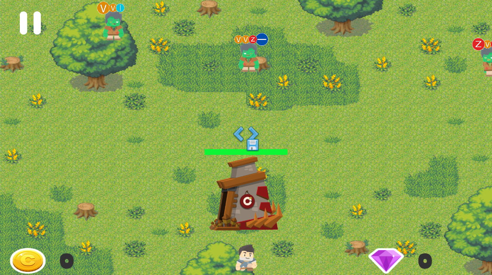
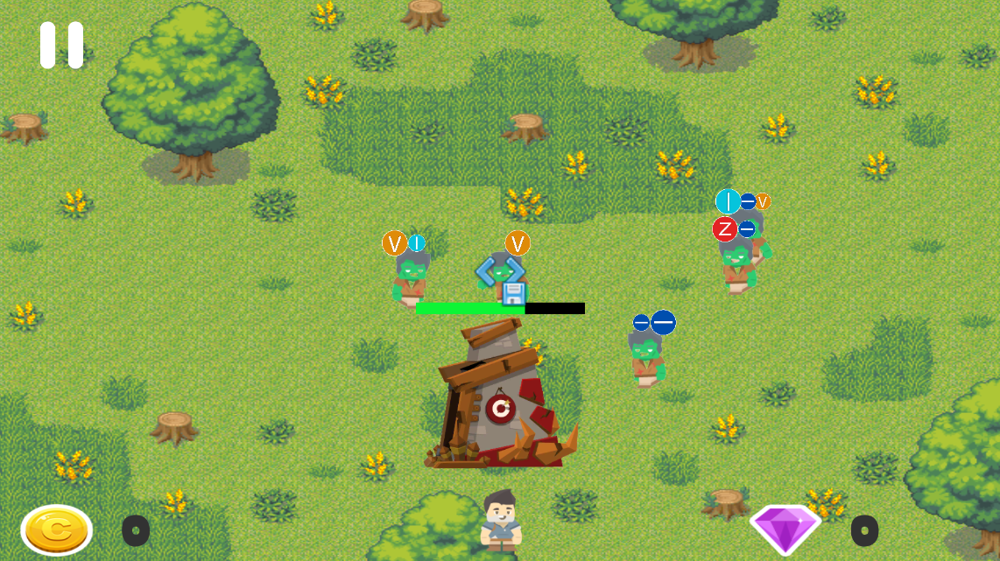
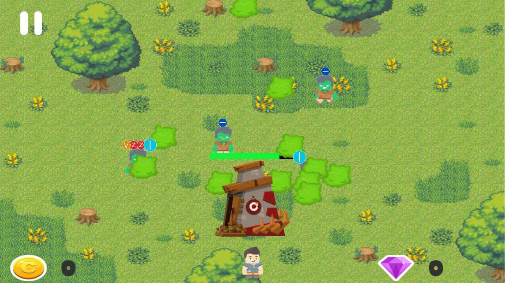
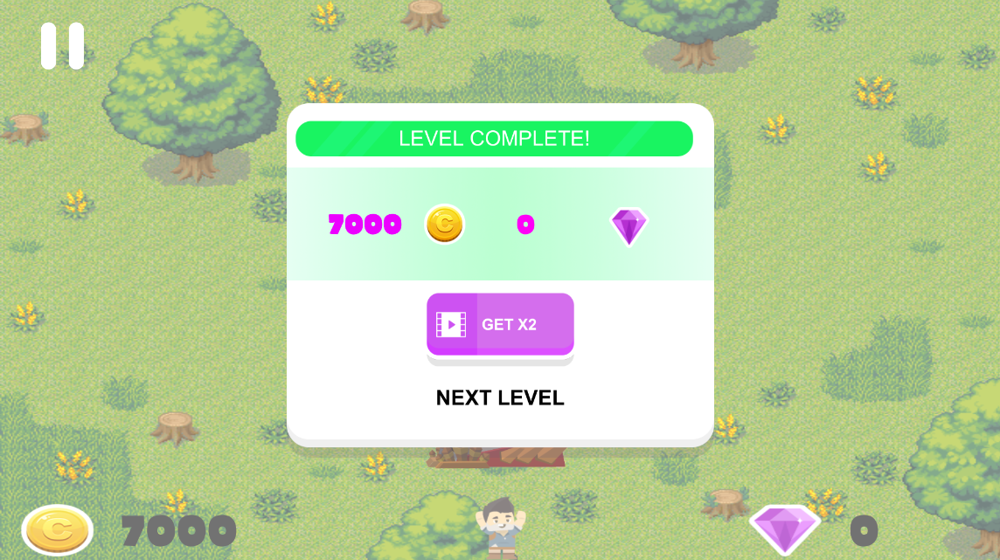
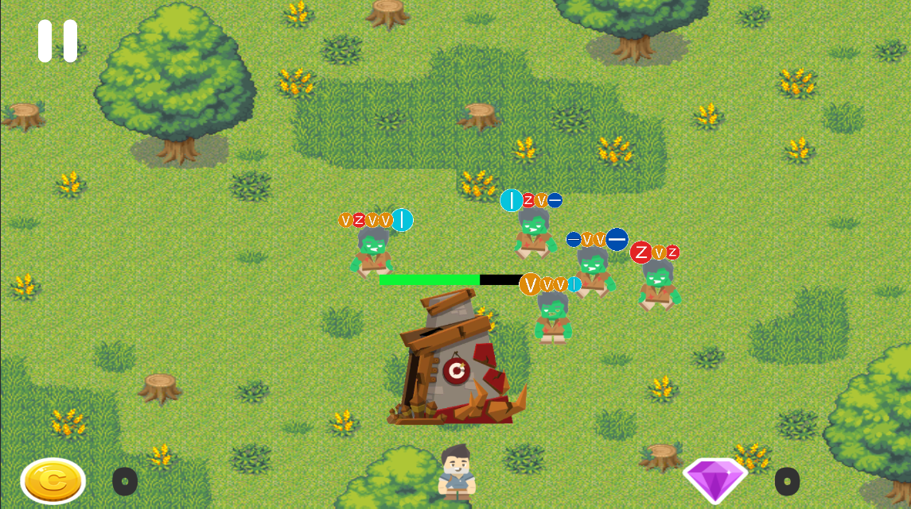

# DrawProject
Игра под платформу Android с распознованием рукописного ввода

Игра предствляет собой Android игру. Мы играем за персонажа, который защищает свою сокровищницу.
Зомби атакуют сокровищницу и пытаются её разрушить, зомби имеют при себе некоторые буквы, которые нужно ввести
на экране для уничтожения зомби. 

Некоторые зомби могут прятаться в кустах, тогда урон по ним не проходит, некоторые напрямую идут к сокровищнице.
Задача - отразить все атаки и защитить сокровища.

